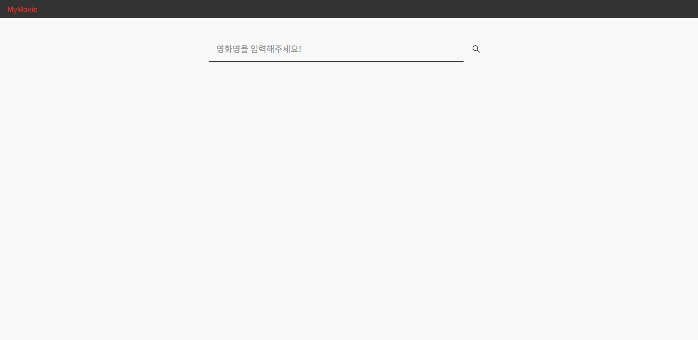

# Movie-serach

네이버 영화 API를 활용한 영화 검색 서비스입니다.

키워드 검색 시 네이버 영화 API의 응답을 받아 리스트를 노출합니다.
 

 
 

## 기능

axios로 http 요청을 하였으며 cors error를 해결하기 위해

- localhost:3000 : 클라이언트
- localhoast:3001 : express 서버

위와 같이 클라이언트와 서버를 분리하여 서버를 통해 데이터를 호출하였습니다.

 
 

## 사용기술

- React
- express
- axios
- styled-components
- react-icons

 
 

## 학습한 것들

- CORS 원인 및 해결방법 [[바로가기]](https://kim-geonsik.notion.site/CORS-68e87d75fbab4931930573b317cc60a7)
- 렌더링과정에서 보존 되어야 하는 값은 useRef [[바로가기]](https://kim-geonsik.notion.site/useRef-b0cdb077479343a8b9b190587c55c114)
- useState는 비동기 [[바로가기]](https://kim-geonsik.notion.site/useState-3a7462509f164404bb1b7120641f2b3b)
- [error] exhaustive-deps-warning [[바로가기]](https://kim-geonsik.notion.site/error-exhaustive-deps-warning-ad76ccdcabd14948a4de4ef88f8e7615)
